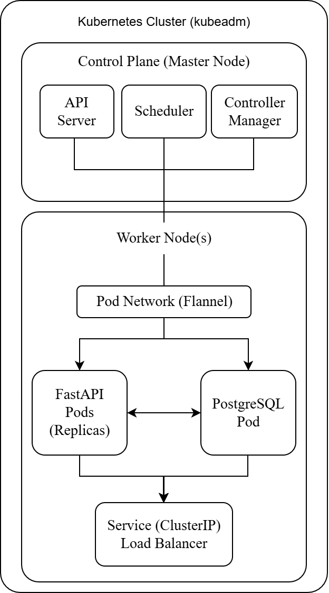
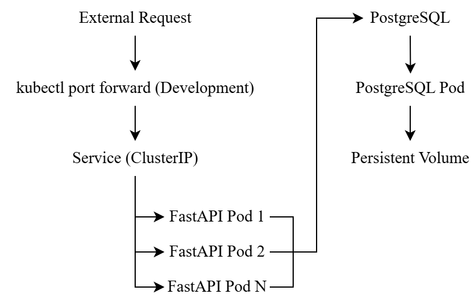

# Kubernetes FastAPI Deployment with Helm

This project is a hands-on learning experience that demonstrates deploying a **FastAPI** application with a **PostgreSQL** database on a **self-managed Kubernetes cluster** built from scratch using **kubeadm**. It covers core **Kubernetes concepts**, **container orchestration**, and **service discovery**, while practices through **Helm-based** deployments. The project emphasizes real-world skills such as debugging, troubleshooting, and implementing production-ready features like health checks and auto-recovery.

## Architecture & Workflow

## Key Features

**Application Layer (FastAPI)**
* **RESTful API** with **CRUD operations** and **health checks**
* **PostgreSQL** integration via **SQLAlchemy ORM**

**Kubernetes Deployment**
* Scalable **FastAPI replicas** with built-in service discovery
* **Self-healing** via liveness/readiness probes
* Resource and configuration management (ConfigMaps, env vars)

**DevOps**
* Reproducible deployments with **Helm**
* **Rolling updates** and **rollback support**

## Tech Stack

| Technology         | Version  | Purpose                                           |
|--------------------|----------|---------------------------------------------------|
| **FastAPI**        | 0.117.1  | Modern Python web framework for building APIs     |
| **Uvicorn**        | 0.37.0   | ASGI server for running FastAPI                   |
| **SQLAlchemy**     | 2.0.43   | SQL toolkit and ORM                               |
| **PostgreSQL**     | 15       | Relational database                               |
| **Psycopg2**       | 2.9.9    | PostgreSQL adapter for Python                     |
| **Pydantic**       | 2.11.9   | Data validation using Python type annotations     |

### Container & Orchestration

| Technology         | Version  | Purpose                                           |
|--------------------|----------|---------------------------------------------------|
| **Docker**         | 27.5.1   | Container runtime for development                |
| **Docker Compose** | 1.29.2   | Multi-container orchestration for local testing   |
| **Kubernetes**     | 1.32.9   | Container orchestration platform                  |
| **kubeadm**        | 1.32.9   | Kubernetes cluster initialization tool            |
| **containerd**     | 1.7.27   | Container runtime for Kubernetes                  |
| **Flannel**        | 0.27.3   | CNI plugin for pod networking                    |

### Deployment & Management

| Technology         | Version  | Purpose                                           |
|--------------------|----------|---------------------------------------------------|
| **Helm**           | 3.19.0   | Kubernetes package manager                        |
| **kubectl**        | 1.32.9   | Kubernetes command-line tool                      |
| **kubelet**        | 1.32.9   | Node agent                                       |

## Lessons Learned

#### **1. ContainerCreating - CNI Network Issues**

Pods were stuck in the `ContainerCreating` state because the Flannel CNI plugin wasn't running correctly. The critical configuration file was missing, which prevented the network setup for the pods.

* **How I fixed it:** We reapplied the Flannel manifest and confirmed all Flannel pods were healthy and running in the `kube-system` namespace.

#### **2. ErrImageNeverPull - Container Runtime Mismatch**

Pods failed to pull images with an `ErrImageNeverPull` error, even though the images were present in our local Docker. The root cause was a mismatch between Docker's image store and `containerd`'s. Kubeadm uses `containerd` by default, so images built with Docker were not visible to the Kubernetes cluster.

* **How I fixed it:** We manually imported the Docker images into the `containerd` image store.

#### **3. CrashLoopBackOff - PVC Binding Failure**

A PostgreSQL pod repeatedly crashed because its PersistentVolumeClaim (PVC) was stuck in a `Pending` state. The PVC was missing a `storageClassName`, while the corresponding PersistentVolume (PV) required `storageClassName: standard`. This mismatch prevented the PV from binding to the PVC.

* **How I fixed it:** We reinstalled the PostgreSQL Helm chart, explicitly defining the storage class to match the PV's configuration. **When using persistent storage, the `storageClassName` must match exactly between the PV and PVC.**
